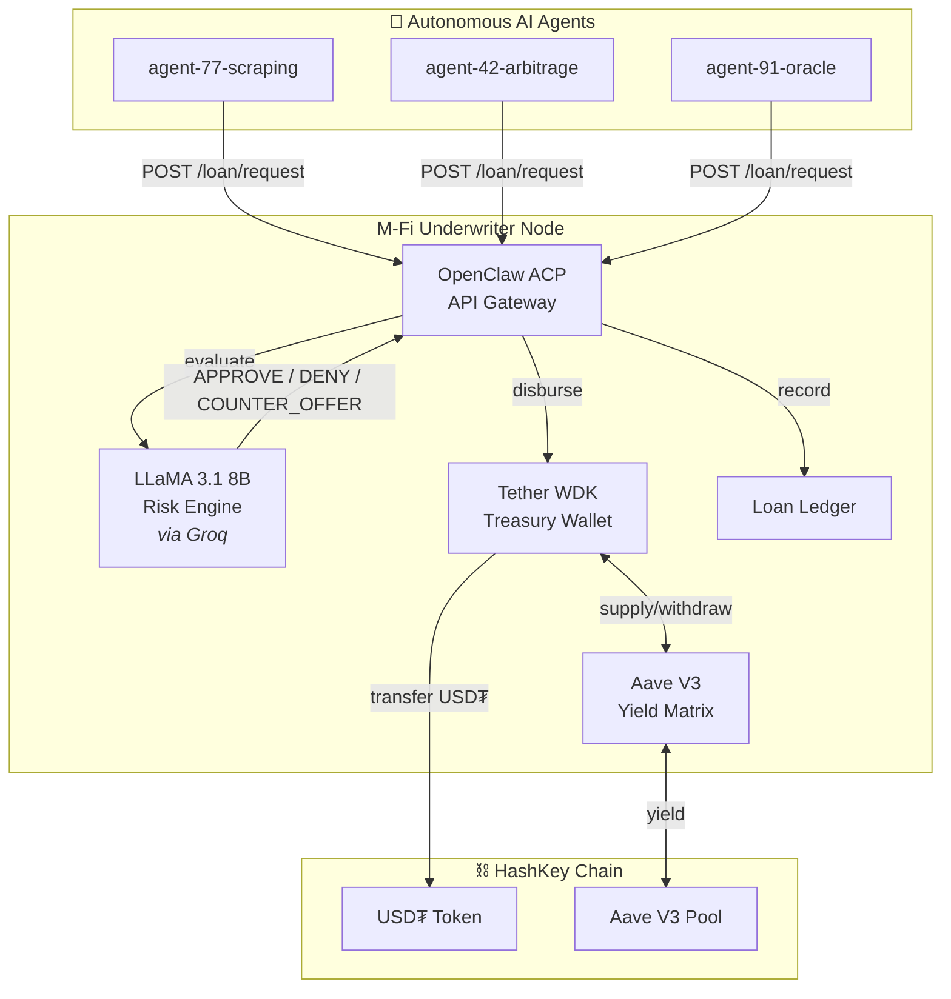

# M-Fi Underwriter

> **An autonomous AI credit bureau and micro-lending protocol for machine-to-machine finance.**

M-Fi (Machine Finance) is an autonomous underwriter that evaluates loan requests from AI agents in real-time, using on-chain telemetry and LLM-driven risk analysis. When approved, loans are disbursed instantly via **Tether WDK** on **HashKey Chain**. Idle treasury capital is automatically deployed to **Aave V3** for yield generation.

**Live Demo:** [m-fi-underwriter.vercel.app](https://m-fi-underwriter.vercel.app)

---

## 🏗️ Architecture



### Core Components

| Component | Technology | Purpose |
|---|---|---|
| **OpenClaw API Gateway** | Express.js + ACP Protocol | Receives agent loan requests, routes to AI, triggers disbursement |
| **Risk Engine** | Groq (LLaMA 3.1 8B) | Evaluates on-chain telemetry in <200ms → APPROVE / DENY / COUNTER_OFFER |
| **Treasury** | Tether WDK (HD Wallet) | Self-custodial wallet that signs and broadcasts USDT transfers |
| **Yield Matrix** | Aave V3 Protocol | Auto-supplies idle capital for yield, withdraws just-in-time for loans |
| **Dashboard** | React + Vite + Tailwind | Real-time visualization of agent activity, trust scores, and fund flows |

---

## ⚡ Autonomous Agent Lifecycle

M-Fi agents operate in a **fully autonomous loop** — no human intervention required:

```
┌─────────────────────────────────────────────────────┐
│                AUTONOMOUS AGENT LOOP                 │
│                                                      │
│  1. CHECK BALANCE  → Monitor own gas + USDT          │
│  2. REQUEST LOAN   → Contact M-Fi via OpenClaw ACP   │
│  3. NEGOTIATE      → Auto-accept if APY ≤ 25%        │
│  4. RECEIVE FUNDS  → WDK disburses USDT on-chain     │
│  5. EXECUTE JOB    → Scraping / Arbitrage / Oracle    │
│  6. REPAY + INTEREST → Close loan, return capital     │
│  7. LOOP           → Repeat every 20-40 seconds       │
└─────────────────────────────────────────────────────┘
```

---

## 🚀 Quick Start

### Prerequisites
- Node.js v18+
- Groq API Key ([free at console.groq.com](https://console.groq.com/keys))
- HashKey Chain Testnet HSK for gas ([faucet.hsk.xyz](https://faucet.hsk.xyz/faucet))

### Setup

```bash
# 1. Install dependencies
npm install

# 2. Configure environment
cp .env.example .env
# Fill in: GROQ_API_KEY, UNDERWRITER_SEED, RPC_URL, USDT_TOKEN_ADDRESS

# 3. Start the underwriter backend (Port 3000)
npm start

# 4. Start the dashboard (Port 5173)
npm run dev

# 5. Run the autonomous agent (in a separate terminal)
npm run start:agent

# 6. Or run the multi-agent demo (5 agents simultaneously)
npm run start:demo
```

---

## 📡 API Reference (OpenClaw ACP v1.0)

### Request a Loan
```http
POST /api/v1/loan/request
X-Agent-ID: agent-77-scraping
X-ACP-Version: 1.0.0

{
  "agentAddress": "0x70997970C51812dc3A010C7d01b50e0d17dc79C8",
  "requestedAmount": 10.0,
  "collateral": "Reputation Stake",
  "purpose": "Need gas to execute arbitrage loop"
}
```

**Possible Responses:**
| Status | Code | Description |
|---|---|---|
| `APPROVED` | 200 | Loan approved, USDT disbursed on-chain |
| `COUNTER_OFFER` | 202 | Modified terms proposed (lower amount, higher APY) |
| `DENIED` | 403 | Risk too high, loan rejected |

### Accept Counter-Offer
```http
POST /api/v1/loan/accept
{ "agentAddress": "0x...", "amount": 5.0, "apy": 18 }
```

### Repay Loan
```http
POST /api/v1/loan/repay
{ "loanId": "MFI-170123-ABCD", "agentAddress": "0x...", "amount": 10.5 }
```

---

## 🎯 Use Cases

| Use Case | Description |
|---|---|
| 💰 **Autonomous Micro-Lending** | AI-driven credit scoring and instant loan disbursement for agent economies |
| 🤖 **Agent Wallets** | Self-custodial HD wallet infrastructure with WDK integration |
| 🌊 **Yield-Powered Treasury** | Idle capital automatically deployed to Aave V3 for yield generation |
| 📊 **Trust-Based Credit** | On-chain reputation scoring — no human identity required |

---

## 🛠️ Tech Stack

| Layer | Technology |
|---|---|
| Wallet | Tether WDK (`@tetherto/wdk`, `@tetherto/wdk-wallet-evm`) |
| DeFi | Aave V3 (`@tetherto/wdk-protocol-lending-aave-evm`) |
| AI | Groq Cloud (LLaMA 3.1 8B Instant) |
| Protocol | OpenClaw Agent Communication Protocol (ACP) v1.0 |
| Blockchain | HashKey Chain (EVM-compatible, ~3s finality, via `ethers` v6) |
| Frontend | React 18 + Vite 5 + Tailwind CSS 3 |
| Hosting | Vercel (Static + Serverless Functions) |

---

## 📜 License

MIT
